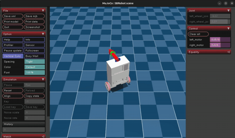
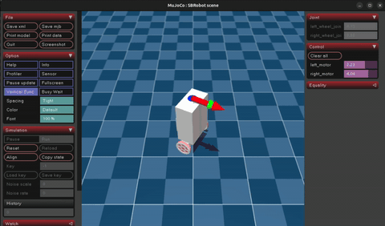

# SBRobot DRL — Self-Balancing Robot with Deep Reinforcement Learning

Training and testing a two-wheeled self-balancing robot (Segway-type) using PPO via Stable Baselines3 and MuJoCo simulation.

## Results

Best checkpoint: `PPO_v2` — robot balances, tracks velocity and heading across all curriculum phases.

**PPO:**

<p align="center">
  
</p>

**SAC:**

<p align="center">
  
</p>


---

## Setup

```bash
python -m venv venv
source venv/bin/activate       # Linux/macOS
pip install -r requirements.txt
```

---

## Training

### Start a new training from scratch

```bash
python train.py \
  --model PPO \
  --processes 32 \
  --iterations 25000000 \
  --n-steps 2048 \
  --learning-rate 0.0003 \
  --ent-coef 0.005 \
  --gamma 0.97 \
  --device cpu \
  --folder-prefix MY_RUN_NAME \
  --headless
```

### Resume training from an existing checkpoint

```bash
python train.py \
  --model PPO \
  --processes 32 \
  --iterations 25000000 \
  --n-steps 2048 \
  --learning-rate 0.0003 \
  --ent-coef 0.005 \
  --gamma 0.97 \
  --device cpu \
  --curriculum-phase 3 \
  --policy CHECKPOINT_FOLDER_NAME \
  --folder-prefix MY_RUN_NAME \
  --headless
```

### All training arguments

| Argument | Default | Description |
|---|---|---|
| `--model` | `PPO` | Algorithm: `PPO`, `SAC`, `TD3`, `A2C`, `DDPG` |
| `--processes` | `50` | Parallel environments. Rule of thumb: N_cores - 2 |
| `--iterations` | `1000000` | Total training steps |
| `--n-steps` | `1024` | Steps per env before PPO/A2C update |
| `--buffer-size` | `100000` | Replay buffer size (SAC/TD3/DDPG only) |
| `--learning-rate` | `3e-4` | Adam learning rate. Halve to `1.5e-4` if in plateau |
| `--ent-coef` | `0.0` | Entropy coefficient (PPO/A2C). Use `0.005` to prevent std collapse |
| `--gamma` | `0.99` | Discount factor. Lower (e.g. `0.97`) = more reactive policy |
| `--device` | `cpu` | `cpu`, `cuda`, or `mps` |
| `--policy` | `None` | Folder name inside `./policies/` to load checkpoint from |
| `--folder-prefix` | timestamp | Output folder name inside `./policies/` |
| `--curriculum-phase` | `0` | Start curriculum at phase 0-3. Use `3` when resuming advanced checkpoint |
| `--headless` | `False` | Suppress MuJoCo viewer during evaluation (safe for SSH/servers) |
| `--wandb` | `False` | Enable Weights & Biases logging |

### Curriculum phases (velocity range)

| Phase | Speed range | When to start here |
|---|---|---|
| 0 | ±0.10 m/s | Fresh training from scratch |
| 1 | ±0.20 m/s | Policy stable at phase 0 |
| 2 | ±0.35 m/s | Policy stable at phase 1 |
| 3 | ±0.50 m/s | Policy stable at phase 2 (~91% of physical max) |

Advancement is automatic: 75% survival rate over 150 episodes triggers the next phase.

---

## Testing

### Interactive test (keyboard control)

```bash
python test.py --path FOLDER_NAME --interactive
```

**Controls:**
- `↑ / ↓` — increase / decrease forward speed (holds last value when released)
- `← / →` — rotate heading left / right
- `R` — reset speed to 0 and heading to random

### Autonomous test (automatic reference changes)

```bash
python test.py --path FOLDER_NAME
```

### All test arguments

| Argument | Default | Description |
|---|---|---|
| `--path` | required | Folder name inside `./policies/` (not full path) |
| `--max-time` | `inf` | Episode time limit in seconds |
| `--test-steps` | `10000` | Number of simulation steps to run |
| `--interactive` | `False` | Enable keyboard control |

---

## Physical constants

| Constant | Value | Description |
|---|---|---|
| `WHEEL_RADIUS` | 0.0625 m | From XML cylinder geometry |
| `WHEEL_TRACK` | 0.2982 m | Distance between wheels |
| `MAX_CTRL` | 8.775 rad/s | Actuator control range |
| `MAX_LIN_VEL` | 0.548 m/s | Physical forward speed limit |
| `MAX_YAW_RATE` | 2.0 rad/s | Practical yaw rate reference limit |

---

## Project structure

```
SBRobot_DRL/
├── train.py                        # Training entry point
├── test.py                         # Testing entry point
├── models/
│   └── scene.xml                   # MuJoCo robot model
├── policies/                       # Saved checkpoints (gitignored)
│   └── RUN_NAME/
│       ├── policy.zip              # Saved model weights
│       ├── config.json             # Training configuration
│       └── videos/                 # Evaluation videos per cycle
└── src/
    ├── env/
    │   ├── robot.py                # Core MuJoCo Gymnasium environment
    │   ├── control/
    │   │   ├── velocity_control.py # Forward velocity reference + curriculum
    │   │   └── pose_control.py     # Heading reference generator
    │   └── wrappers/
    │       ├── observations.py     # Sensor fusion + normalised observation vector
    │       └── reward/
    │           └── reward.py       # Shaped reward (balance + velocity + heading)
    └── utils/
        ├── parser.py               # CLI argument parsing
        └── files.py                # Backup and compression utilities
```

---

## Control interface

The robot uses a **(v, ω)** joystick-style interface:
- **v** — forward velocity reference [m/s]
- **ω** — yaw rate reference [rad/s] (positive = CCW / left, negative = CW / right)

Both signals are directly measurable from wheel encoders and the gyroscope Z axis — no magnetometer or external localisation is needed, making sim-to-real transfer straightforward.

---

## Reward structure

```
r_balance  = exp(-((pitch - K·vel_error) / σ_pitch)²)   ∈ [0, 1]
r_velocity = exp(-(vel_error / σ_vel)²)                  ∈ [0, 1]
r_yaw      = exp(-(yaw_rate_error / σ_yaw)²)             ∈ [0, 1]
r_task     = r_balance × (w_b + w_v·r_velocity + w_ω·r_yaw)
r_smooth   = −w_smooth × mean((Δfiltered_action / MAX_CTRL)²)

reward = r_task + r_smooth      (fall → −20)
```

Key design choices:
- **Balance gates everything**: no reward for tracking while tilted
- **Pitch reference follows velocity error**: robot leans forward to accelerate, upright at cruise
- **Yaw rate interface**: tracks commanded ω [rad/s] instead of absolute heading — gyroscope Z provides a reliable, no-drift signal in short episodes
- **Tight σ_vel at v=0**: prevents drift when standing still (σ=0.04 vs 0.35 at speed)
- **Smoothness on filtered actions**: penalty on what the actuators actually do, not raw policy output
- **Independent L/R randomization**: actuator gains and wheel friction randomized separately to simulate real hardware asymmetry

---

## Transferring a checkpoint to another machine

```bash
# Pack
tar -czf PPO_my_checkpoint.tar.gz -C ./policies PPO_my_checkpoint

# Unpack on the other machine
tar -xzf PPO_my_checkpoint.tar.gz -C ./policies/
```

Then resume training from that checkpoint using `--policy PPO_my_checkpoint`.
